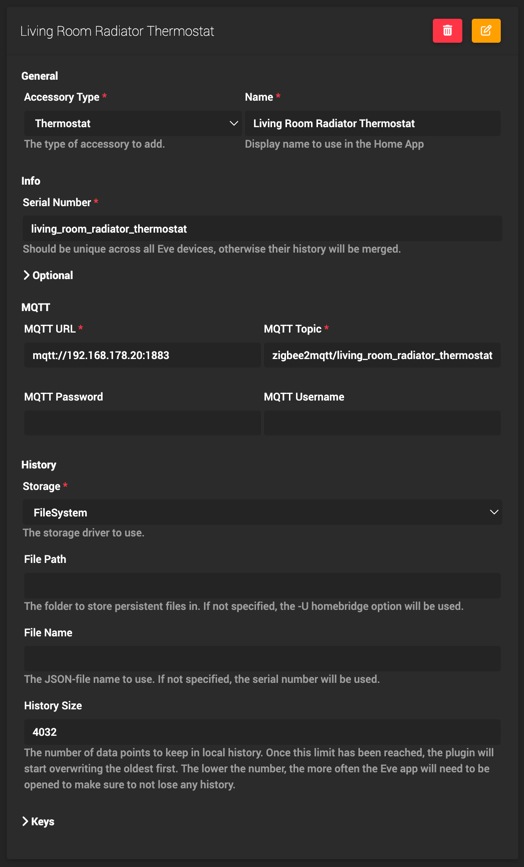
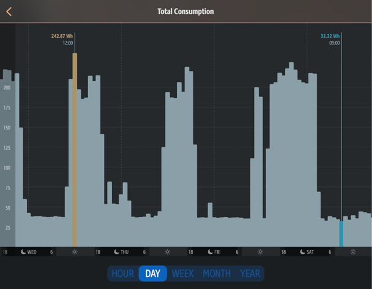
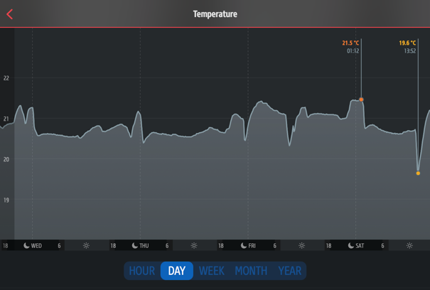
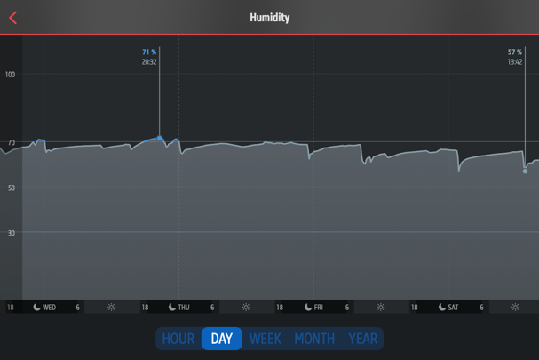

# homebridge-mqtt-eve

A [Homebridge](https://github.com/homebridge/homebridge) plugin that emulates Eve devices and their history by connecting to an MQTT server and parsing incoming
messages.

This plugin utilizes the excellent [fakegato-history](https://github.com/simont77/fakegato-history) module to add history capabilities. (Only visible in the Eve.app)

It's recommended to use [zigbee2mqtt](https://github.com/Koenkk/zigbee2mqtt) to make the devices available via MQTT,
and then use this plugin to create accessories in Homebridge.

### Currently supported device types:

- Energy
- Climate
- Contact
- Thermo

## Config

See the Homebridge Config UI for configuration:

## Examples
### Energy

### Climate

